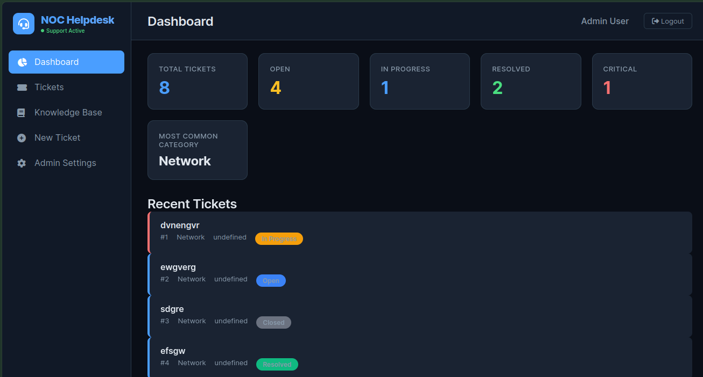

# 🎧 NOC Helpdesk Ticketing System

A professional, enterprise-ready IT Service Management (ITSM) platform built with FastAPI and vanilla JavaScript. This project demonstrates real-world IT support workflows including incident management, troubleshooting documentation, ticket lifecycle management, and service desk operations.

[](https://www.python.org/)
[](https://fastapi.tiangolo.com/)
[](LICENSE)

---

## 📸 Project Screenshot



---

## 🚀 Features

### 🔐 Authentication & Security
- **User Registration & Login** with JWT tokens
- **Role-Based Access Control** (Admin, Technician, User)
- **Secure Password Hashing** with bcrypt
- **Protected Routes** - Only authenticated users can access tickets
- **Session Management** - Tokens stored in localStorage

### 🎫 Ticket Management
- Create and manage support tickets
- Assign tickets to technicians by username or email
- Track ticket priority (Low, Medium, High, Critical)
- Track ticket status (Open, In Progress, Resolved, Closed)
- Filter tickets by status, priority, and category
- Search tickets by title
- Color-coded priorities for quick identification

### 📝 Ticket Activity Timeline
Every ticket maintains a complete audit trail:
- ✅ Ticket created
- ✅ Status changed (Open → In Progress → Resolved → Closed)
- ✅ Assigned to technician
- ✅ Troubleshooting notes added
- ✅ Ticket resolved with documentation

### 📋 Resolution Documentation
Technicians can document:
- **Root Cause** - What caused the issue
- **Troubleshooting Steps** - Steps taken to investigate
- **Resolution Summary** - How the issue was fixed
- **Prevention Notes** - How to prevent future occurrences

### 📚 Knowledge Base
- Convert resolved tickets into reusable knowledge articles
- Searchable by title and problem description
- Categorized by Network, Hardware, Software, Access
- Reduces repeat tickets by enabling self-service

### 📊 NOC-Style Dashboard
Real-time analytics showing:
- Total Tickets
- Open Tickets
- In Progress Tickets
- Resolved Tickets
- Critical Issues
- Most Common Category

### 📧 Email-to-Ticket Automation (Enterprise Feature)
- **Automatic ticket creation** from support emails
- **Smart priority detection** based on keywords (Critical, High, Medium, Low)
- **Smart category detection** based on keywords (Network, Hardware, Software, Access)
- **Duplicate prevention** - Detects and prevents duplicate tickets
- **Email processing logs** for auditing
- **Configurable check intervals**

### ⚙️ Admin Settings
- Configure email settings from the dashboard (no coding required)
- Test email connections
- View email processing statistics

### 🎨 Modern UI/UX
- **Dark NOC Theme** - Professional monitoring center aesthetic
- **Mobile Responsive** - Works on desktop, tablet, and mobile
- **Headset Logo** with live status indicator
- **Support Active** badge with blinking dot
- **Font Awesome Icons** for visual clarity

---

## 🏗 Architecture


```bash
helpdesk-tracker/
├── backend/ # FastAPI REST API
│ ├── app/ # Application core
│ │ ├── models.py # SQLAlchemy database models
│ │ ├── schemas.py # Pydantic schemas for validation
│ │ ├── auth.py # JWT authentication utilities
│ │ ├── routes/ # API endpoints
│ │ └── services/ # Business logic (email, etc.)
│ ├── requirements.txt # Python dependencies
│ └── run.py # Server entry point
└── frontend/ # Vanilla JavaScript SPA
├── index.html # Main application
├── login.html # Authentication page
├── register.html # User registration
├── admin.html # Admin settings
├── css/ # Styling
└── js/ # JavaScript modules
```


---
---

## 🧰 Tech Stack

### Backend
| Technology | Version | Purpose |
|------------|---------|---------|
| Python | 3.11+ | Programming language |
| FastAPI | 0.115.6 | Web framework |
| SQLAlchemy | 2.0.36 | ORM |
| SQLite | - | Database (development) |
| PostgreSQL | - | Database (production) |
| JWT | - | Authentication |
| APScheduler | 3.10.4 | Email scheduling |
| Pydantic | 2.10.4 | Data validation |

### Frontend
| Technology | Purpose |
|------------|---------|
| HTML5 | Structure |
| CSS3 | Styling & Dark Theme |
| Vanilla JavaScript | Dynamic functionality |
| Font Awesome | Icons |
| Google Fonts (Inter) | Typography |

---

## ⚙️ Installation

### Prerequisites
- Python 3.11 or higher
- pip (Python package manager)
- Git (optional)

### Backend Setup

```bash
# Navigate to backend directory
cd backend

# Create virtual environment
python -m venv venv

# Activate virtual environment
# On Windows:
venv\Scripts\activate
# On Linux/Mac:
source venv/bin/activate

# Install dependencies
pip install -r requirements.txt

# Create environment variables file
cp .env.example .env
# Edit .env with your settings (optional)

# Run the server
python run.py

# API available at:
# http://localhost:8000
# API Documentation: http://localhost:8000/docs
```

---

### Frontend Setup

```bash
# Navigate to frontend directory
cd frontend

# Start a simple HTTP server
python -m http.server 8081

# Application available at:
# http://localhost:8081
# Login: http://localhost:8081/login.html
# Register: http://localhost:8081/register.html
```
---

# 🎯 Project Purpose

This project was created as a portfolio demonstration for IT Support / Network Engineering roles.

The goal is to demonstrate understanding of:

- IT service workflows
- Incident management
- Troubleshooting processes
- Documentation practices
- Backend API development

---

## 🤝 Contributing

Contributions are welcome! Please feel free to submit a Pull Request.

1. Fork the repository
2. Create your feature branch (`git checkout -b feature/AmazingFeature`)
3. Commit your changes (`git commit -m 'Add some AmazingFeature'`)
4. Push to the branch (`git push origin feature/AmazingFeature`)
5. Open a Pull Request

---

## 📝 License

This project is licensed under the MIT License - see the [LICENSE](LICENSE) file for details.

---

## 👨🏽‍💻 Author

**Kingsley**
- IT Support Engineer | Networking | Cybersecurity

---

## 🙏 Acknowledgments

- FastAPI for the amazing web framework
- Font Awesome for the beautiful icons
- Inter font for the clean typography

---

## 📞 Support

For support, please create an issue in the GitHub repository or contact the author.

---

**Built with ❤️ for IT Support Engineers**
